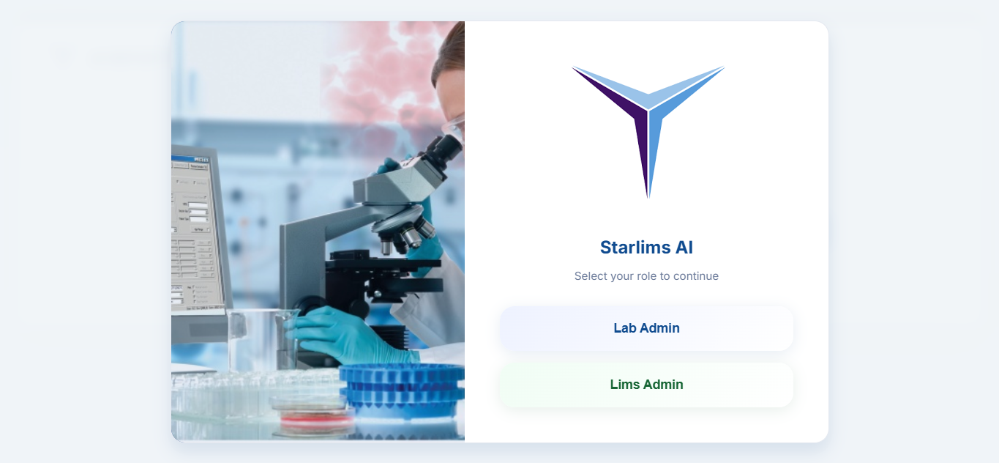
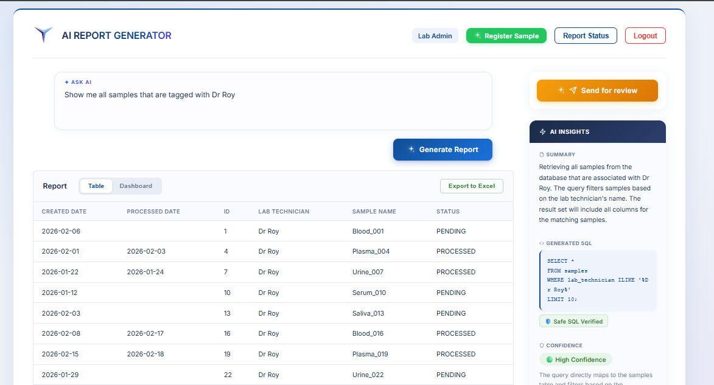
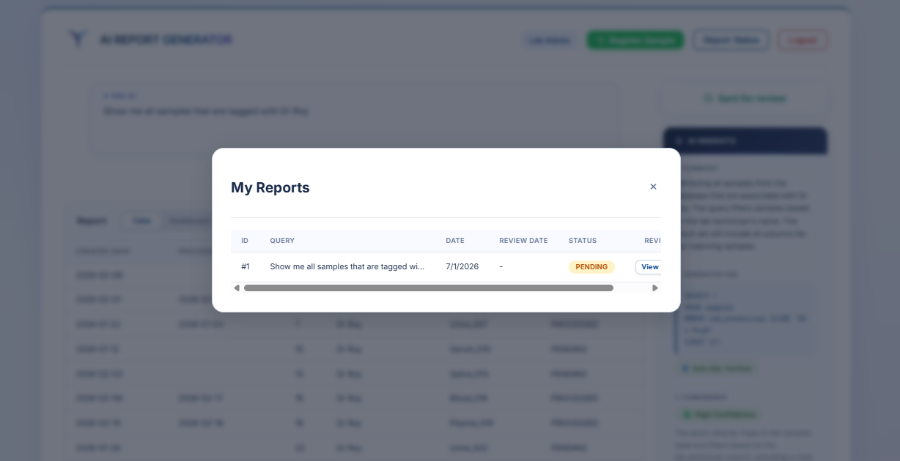
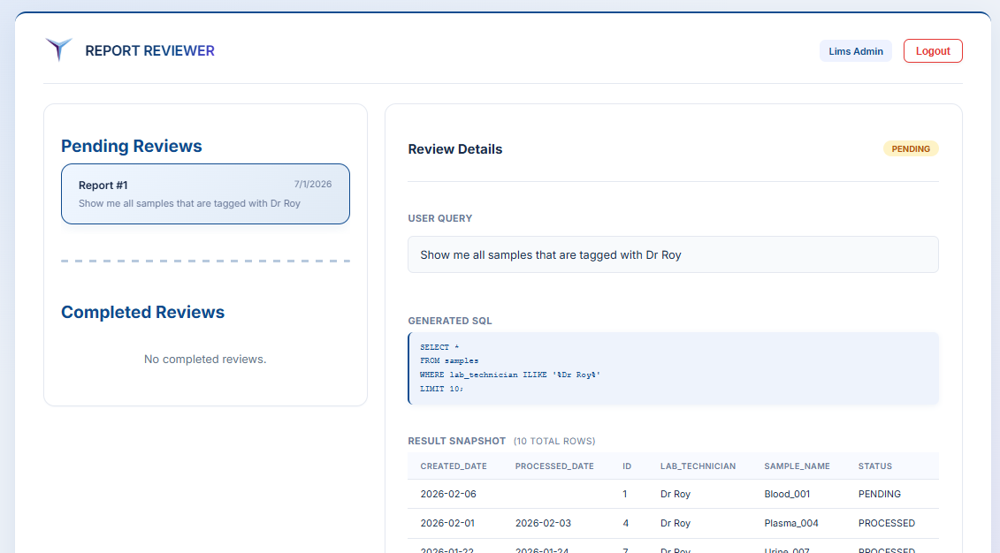
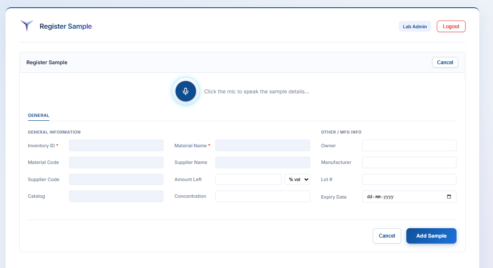
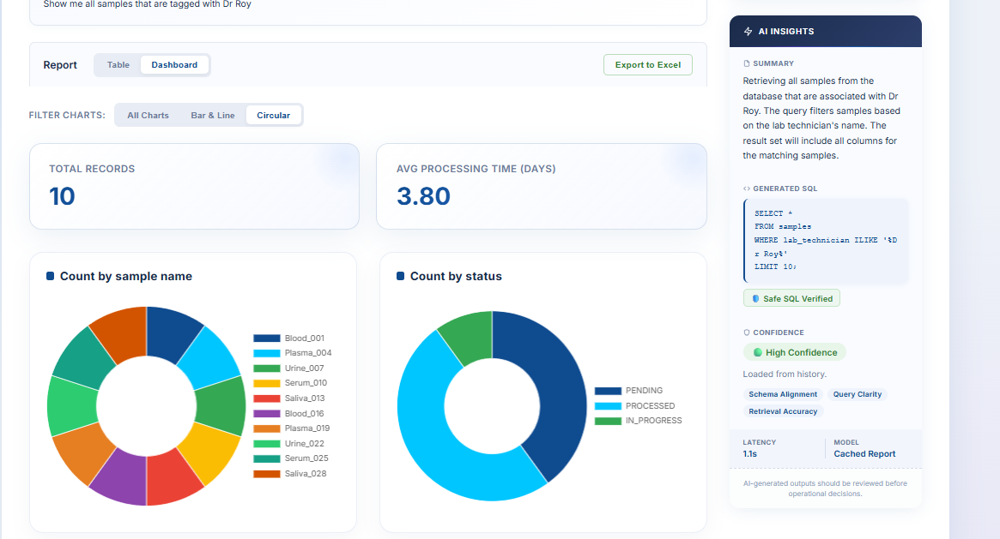

# 🧪 StarLIMS AI Engine

> **An enterprise AI platform built with Spring Boot that enables laboratory users to generate reports and create laboratory samples using natural language while maintaining secure, human-in-the-loop approval workflows.**

StarLIMS AI Engine combines **AWS Bedrock**, **Advanced RAG**, **PGVector**, **LLM Tool Calling**, and **Redis Semantic Caching** to simplify enterprise laboratory workflows. The platform allows users to interact with StarLIMS through natural language instead of manually writing SQL queries or filling lengthy forms.

---

# 🚀 Overview

StarLIMS AI Engine introduces AI-powered capabilities into enterprise laboratory operations through two primary workflows:

- 📊 Natural Language Report Generation
- 🧪 AI-Assisted Sample Creation

The platform follows a role-based workflow where **Lab Admins** initiate AI-assisted operations and **LIMS Admins** review and approve AI-generated SQL before execution, ensuring governance and human oversight throughout the process.

---

# 📸 Landing Page

<p align="center">
    
</p>

---

# ✨ Key Features

## 📊 AI-Powered Report Generation

Lab Admins can generate reports by simply describing their requirements in natural language.

Example:

> *Generate a report showing stability samples pending approval for more than 7 days.*

The AI automatically:

- Understands user intent
- Retrieves relevant schema using **Advanced RAG**
- Searches across **300+ enterprise database tables**
- Generates optimized SQL using **LLM Tool Calling**
- Executes the query
- Displays results in a structured tabular format
- Allows exporting reports directly to Excel

### Report Generation

<p align="center">
    
</p>

---

## 👥 Enterprise Approval Workflow

### 🧪 Lab Admin

Lab Admins can:

- Generate reports using natural language
- View generated reports
- Export reports to Excel
- Create laboratory samples using voice or chat
- Submit generated SQL for review

### Report Submitted for Review

<p align="center">
    
</p>

---

### ⚙️ LIMS Admin

LIMS Admins can:

- Review AI-generated SQL
- Approve or reject report requests
- Validate generated queries before execution
- Ensure enterprise governance and accuracy

### LIMS Admin Review

<p align="center">
    
</p>

---

## 🎙️ AI-Assisted Sample Creation

Lab Admins can create laboratory samples through natural language instead of manually filling lengthy forms.

Example:

> *Create a blood sample for patient John Doe collected today with high priority.*

The AI:

- Extracts structured information
- Uses **LLM Tool Calling** to identify required fields
- Automatically populates the StarLIMS sample creation form
- Saves the request as a draft
- Allows users to verify every field before submission

The application never submits records automatically, ensuring users remain in complete control.

### Sample Creation using Natural Language

<p align="center">
    
</p>

---

# 🏗️ System Architecture

> *(Add your architecture diagram here if available.)*

---

# 🧠 AI Capabilities

- Advanced RAG over **300+ enterprise database tables**
- Natural Language → SQL Generation
- LLM Tool Calling
- Voice & Chat-based Sample Creation
- Semantic Schema Retrieval using **PGVector**
- Redis Semantic Caching
- Human-in-the-Loop Approval Workflow
- Excel Report Export

---

# ⚡ Technology Stack

### Backend

- Spring Boot
- Java

### AI

- AWS Bedrock
- Advanced RAG
- LLM Tool Calling
- Natural Language Understanding (NLU)

### Vector Search

- PGVector

### Databases

- PostgreSQL (PGVector)
- Oracle (StarLIMS)

### Cache

- Redis Semantic Cache


---

# 🔄 Application Workflow

```text
                    Lab Admin
                        │
        Natural Language / Voice Input
                        │
                        ▼
               Spring Boot Backend
                        │
          Advanced RAG (PGVector)
                        │
                        ▼
                  AWS Bedrock
                        │
          LLM Tool Calling & SQL Generation
                        │
                        ▼
               StarLIMS Database
                        │
                        ▼
             LIMS Admin Review & Approval
                        │
                        ▼
         Structured Report / Excel Export
```

---

# 📈 Report Dashboard

The generated reports can be visualized through interactive charts in addition to structured tabular results.

<p align="center">
    
</p>

---

# 🚀 Getting Started

Clone the repository

```bash
git clone https://github.com/Oishik07/Starlims_AI_ReportGenerator.git
```

Navigate to the project

```bash
cd Starlims_AI_ReportGenerator
```

Configure the required environment variables.

```properties
AWS_ACCESS_KEY=
AWS_SECRET_KEY=
BEDROCK_MODEL=
DATABASE_URL=
REDIS_URL=
```

Run the Spring Boot application.

---

# 👨‍💻 Author

**Oishik Bandyopadhyay**

**AI Engineer | Applied AI | Agentic AI | LLM Engineering | Advanced RAG | Spring Boot**

- 💼 LinkedIn
- 💻 GitHub
